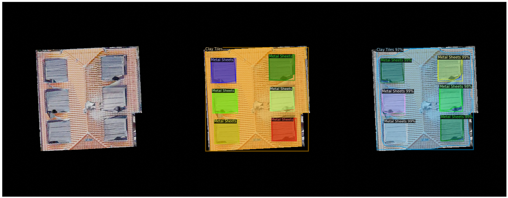
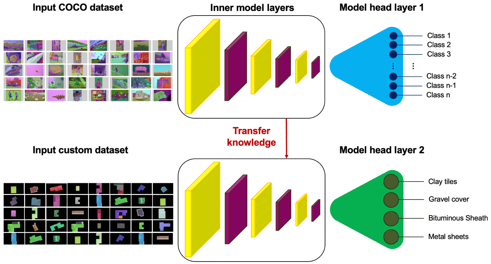
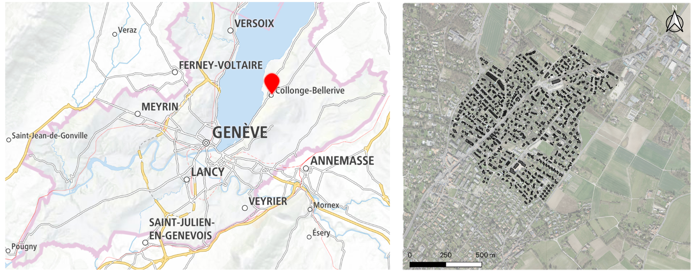
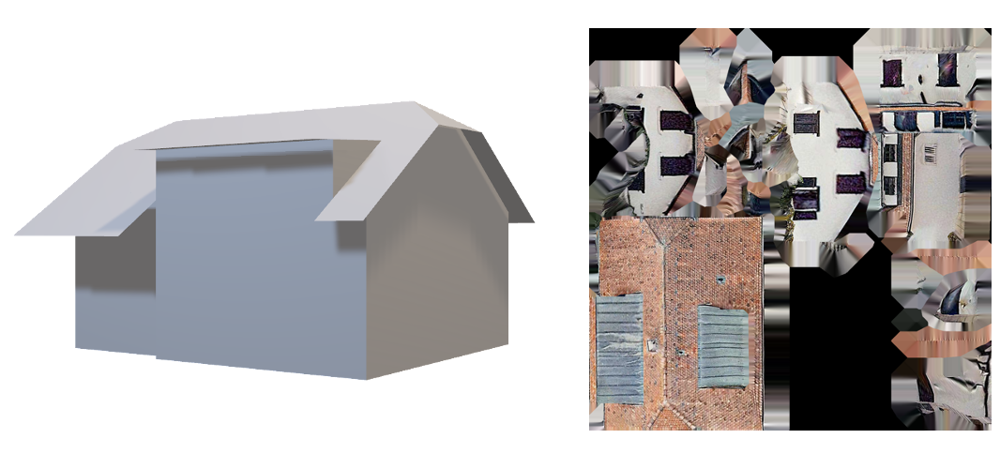
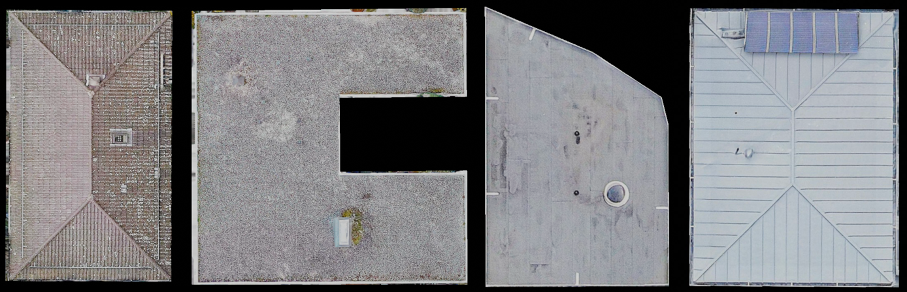
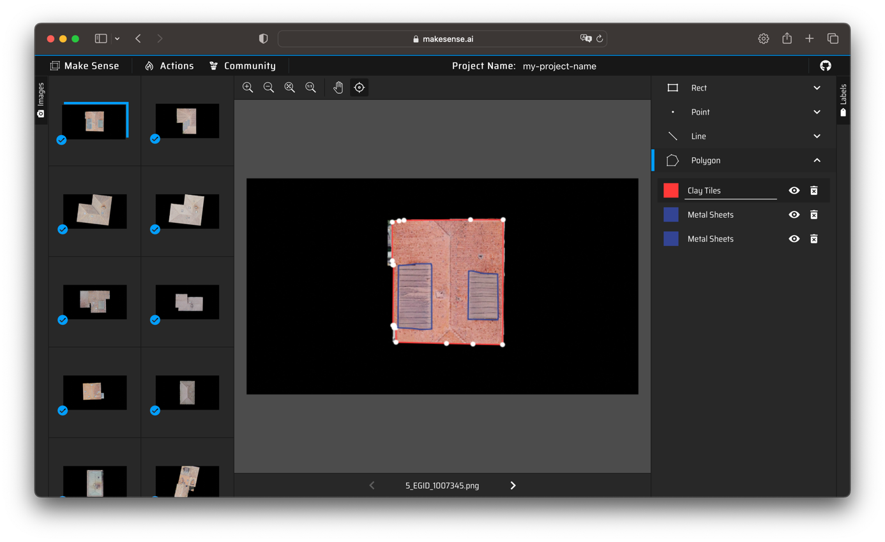
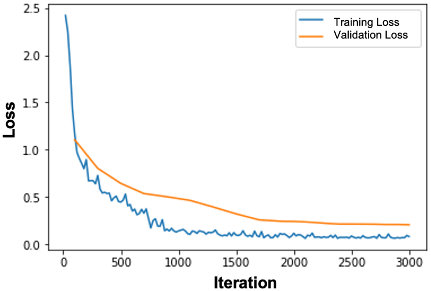
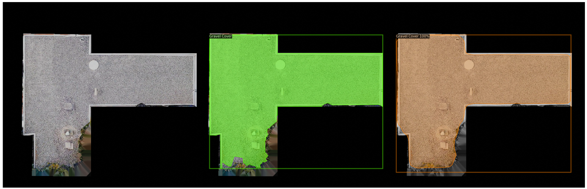

# Urban-Scale Building Rooftop Material Detection Using Computer Vision

> A Master's thesis project that trains a Mask R-CNN instance segmentation model on ultra-high-detail aerial imagery to **detect, segment and quantify** the materials of building rooftops at urban scale — laying the groundwork for a spatial material-stock database for circular construction.

<p align="center">
  
</p>
<p align="center"><em>Model inference on a multi-instance rooftop image: ground truth, annotation, and predicted instance masks (clay tiles, gravel cover, bituminous sheathing, metal sheets).</em></p>

---

## Table of Contents

- [Overview](#overview)
- [Why this project exists](#why-this-project-exists)
- [Pipeline](#pipeline)
- [Data](#data)
- [Model & Results](#model--results)
- [Repository Structure](#repository-structure)
- [Prerequisites & Installation](#prerequisites--installation)
- [Usage](#usage)
- [Computing a Material Take-off](#computing-a-material-take-off)
- [Author & Acknowledgements](#author--acknowledgements)

---

## Overview

The Architecture, Engineering and Construction (AEC) industry consumes most of the world's raw materials and is responsible for ~37% of global greenhouse-gas emissions, yet still operates on a linear *take-make-waste* model. A move to a **circular economy** in construction depends on knowing **what materials are already embedded in the existing built stock** — but that data is mostly unavailable today.

This project asks: *can we mine the material composition of buildings directly from urban-scale aerial photogrammetry?*

The repository delivers a complete, reproducible proof-of-concept:

1. **A novel rooftop dataset** built from ultra-high-detail 3D digital shadows of buildings produced by aerial photogrammetry (Uzufly).
2. **A fine-tuned Mask R-CNN model** (Detectron2, COCO-pretrained ResNeXt-101 backbone) that performs instance segmentation across four roof material classes.
3. **A material take-off pipeline** that converts a segmented rooftop image into an approximate per-material surface area in square metres.

The trained model achieves **AP = 81.4%**, **AP₅₀ = 93.8%**, **AP₇₅ = 88.1%** on the held-out validation set.

## Why this project exists

The thesis distinguishes itself from prior work (which focused on either building footprint detection from satellite images or facade analysis from terrestrial photos) by:

- using a single, **truly scalable** input source (aerial photogrammetry) to extract rich material information for the entire building exterior;
- producing imagery dense enough to support **condition assessment**, not just classification;
- providing an **end-to-end methodology** — data acquisition → pre-processing → annotation → augmentation → training → material take-off — that other practitioners can reuse and extend.

<p align="center">
  
</p>
<p align="center"><em>Transfer-learning scheme: a COCO-pretrained instance-segmentation backbone is reused, and only the head layer is replaced with one whose nodes correspond to the four custom roof classes.</em></p>

## Pipeline

```
3D textured building objects (.obj + .mtl)
            │
            ▼   Blender + custom Python script (5 cameras × N buildings)
2D rooftop renderings (1920×1080 RGBA → RGB)
            │
            ▼   Manual filtering (197 high-quality rooftops)
            ▼   Manual COCO-style annotation (Make Sense AI)
            ▼   Albumentations augmentation (contrast / gamma / saturation / color jitter)
Augmented dataset (310 images, 4 balanced classes)
            │
            ▼   Detectron2 — fine-tune Mask R-CNN X101-FPN
Trained instance-segmentation model
            │
            ▼   Inference + pixel-area accounting
Approximate per-material surface area (m²)
```

## Data

### Source

Raw data was provided by **[Uzufly](https://uzufly.com/)**, an EPFL spin-off that captures ultra-high-detailed 3D digital shadows of buildings via aerial photogrammetry. The study area is the commune of **Collonge-Bellerive** (east of Lake Geneva), covering **1,204 buildings** over ~2 km².

<p align="center">
  
</p>

Each building is identified by its Swiss federal **EGID** number and is delivered as a `.obj` 3D mesh + `.mtl` photo-mesh texture pair.

<p align="center">
  
</p>

### Pre-processing

A custom Blender script automates the rendering of every building:

1. Import the textured 3D object.
2. Align local axes with global axes and centre the object.
3. Place 5 uniform light sources (4 sides + top) and 5 orthographic cameras (40 m scale).
4. Render full-HD frames from all 5 viewpoints.
5. Save outputs as `<viewpoint>_EGID_<id>.png` and convert RGBA → RGB.

Of the resulting 5,120 renders, only the **top-view rooftop frames** were of usable quality (façades suffered from severe warping/occlusions). After hand-filtering for edge blur, warping, occlusion and capture artefacts, **197 high-quality rooftop images** were retained.

### Classes

Four rooftop material classes are observed in the dataset:

<p align="center">
  
</p>

| ID | Class               | Description                                                                                      |
|----|---------------------|--------------------------------------------------------------------------------------------------|
| 1  | **Clay Tiles**      | Sloped roofs with ceramic shingles. Most common in Switzerland (and in this dataset).            |
| 2  | **Gravel Cover**    | Flat roofs with a loose gravel/ballast layer protecting a tar substrate.                         |
| 3  | **Bituminous Sheath** | Flat roofs with bituminous waterproofing (no top gravel layer).                                |
| 4  | **Metal Sheets**    | Sloped roofs of galvanised metal.                                                                |

### Annotation

Images were annotated manually as polygon masks using **[Make Sense AI](https://www.makesense.ai/)** and exported as **COCO-style JSON**. Edge blur, occlusions and irrelevant components (balconies, glass ceilings) were deliberately excluded from the masks so the model would not learn them as part of any material texture.

<p align="center">
  
</p>

### Augmentation & class balancing

The raw dataset is heavily clay-tile-biased. The minority classes (gravel cover, bituminous sheath, metal sheets) were oversampled with the **[Albumentations](https://albumentations.ai/)** library, varying contrast, gamma, saturation and color jitter on single-instance images only. This expanded the dataset to **310 images** with balanced class instance counts.

### Final datasets in this repo

| Split              | Images | Annotations file                                       | Location                                              |
|--------------------|-------:|--------------------------------------------------------|-------------------------------------------------------|
| Training (augmented)   | 255 | `02-Datasets/Annotations/trainanno_4C_AUG.json`        | `02-Datasets/Augmented Training Dataset/`             |
| Validation (augmented) |  55 | `02-Datasets/Annotations/testanno_4C_AUG.json`         | `02-Datasets/Augmented Validation Dataset/`           |

Each image is named `5_EGID_<building_id>.png` (the leading `5` denotes the top-view camera).

## Model & Results

The main model is **Mask R-CNN with a ResNeXt-101 + FPN backbone (`mask_rcnn_X_101_32x8d_FPN_3x`)**, fine-tuned from COCO weights via transfer learning. A lighter `mask_rcnn_R_50_FPN_3x` variant was used for fast experimentation.

### Training configuration

| Hyperparameter                    | Value         |
|-----------------------------------|---------------|
| `SOLVER.IMS_PER_BATCH`            | 2             |
| `SOLVER.BASE_LR`                  | 0.00025       |
| `SOLVER.MAX_ITER`                 | 3000          |
| `MODEL.ROI_HEADS.BATCH_SIZE_PER_IMAGE` | 512      |
| `MODEL.ROI_HEADS.NUM_CLASSES`     | 4             |
| `TEST.EVAL_PERIOD`                | 100           |
| Confidence threshold (inference)  | 0.7           |

A custom `LossEvalHook` was added to log **validation loss** alongside training loss every `EVAL_PERIOD` iterations — by default Detectron2 only logs training loss.

### Loss curves

<p align="center">
  
</p>

Both curves decline smoothly and plateau by iteration ~2000 — no signs of underfitting or overfitting.

### Segmentation evaluation (COCO metrics)

| Metric  | Value     |
|---------|-----------|
| AP      | **81.43%** |
| AP₅₀    | **93.78%** |
| AP₇₅    | **88.07%** |

Per-class AP:

| Class             | AP      |
|-------------------|---------|
| Clay Tiles        | 89.28%  |
| Gravel Cover      | 73.36%  |
| Bituminous Sheath | 77.96%  |
| Metal Sheets      | 83.11%  |

The model excels as a classifier; small per-class gaps stem from edge-blur in the source photogrammetry, which most affects gravel cover and bituminous sheath whose textures resemble the blurs themselves.

### Qualitative inference

<p align="center">
  
</p>
<p align="center"><em>Single-instance gravel-cover rooftop. The model correctly excludes the tree occlusion at the bottom from the predicted mask.</em></p>

## Repository Structure

```
.
├── 01-Source-Code/
│   ├── Final_Notebook/
│   │   └── mod_final_presentation.ipynb         # End-to-end pipeline (use this one)
│   └── Other_Notebooks/
│       ├── mod1_3000_val_loss_batch_head_512_true_counter_plot.ipynb   # R50, 3000 iter
│       ├── mod1_6000_val_loss_true_counter_plot.ipynb                  # R50, 6000 iter
│       ├── mod2_3000_val_loss_batch_head_512_true_counter_plot.ipynb   # X101, 3000 iter
│       └── mod2_6000_val_loss_batch_head_512_true_counter_plot.ipynb   # X101, 6000 iter
├── 02-Datasets/
│   ├── Annotations/
│   │   ├── trainanno_4C_AUG.json                # COCO-style training annotations
│   │   └── testanno_4C_AUG.json                 # COCO-style validation annotations
│   ├── Augmented Training Dataset/              # 255 PNG renders
│   └── Augmented Validation Dataset/            #  55 PNG renders
├── docs/images/                                 # Figures used in this README
└── README.md
```

## Prerequisites & Installation

> The notebooks were originally developed and run on **Google Colab** (free Tesla T4 / P100 GPU). They can be run locally on any machine with an NVIDIA GPU and a recent CUDA install. Detectron2 *can* run CPU-only but is impractically slow for training.

### Software requirements

- **Python ≥ 3.8**
- **NVIDIA GPU** with a working **CUDA** toolkit (highly recommended)
- **PyTorch** + **torchvision** (matching your CUDA version)
- **Detectron2** (Facebook AI Research)
- **OpenCV** (`opencv-python`)
- **NumPy**, **Matplotlib**, **PyYAML 5.1**
- **Jupyter** (to run the notebooks)
- **Blender ≥ 3.0** (only required if you want to **regenerate** the 2D renders from the original 3D building objects; not needed to train or run inference)
- **Albumentations** (only required if you want to regenerate augmentations from scratch)

### Option A — run on Google Colab (matches the notebook as-is)

Just open `01-Source-Code/Final_Notebook/mod_final_presentation.ipynb` in Colab. The first two cells handle everything:

```python
# Cell 1 — mount Drive
from google.colab import drive
drive.mount('/content/drive')

# Cell 2 — install Detectron2
!python -m pip install pyyaml==5.1
!git clone https://github.com/facebookresearch/detectron2
import distutils.core
dist = distutils.core.run_setup("./detectron2/setup.py")
!python -m pip install {' '.join([f"'{x}'" for x in dist.install_requires])}
import sys, os
sys.path.insert(0, os.path.abspath('./detectron2'))
```

### Option B — run locally

```bash
# 1. Create and activate a fresh environment
python -m venv .venv
source .venv/bin/activate          # Windows: .venv\Scripts\activate

# 2. Install PyTorch (pick the build that matches your CUDA)
#    See https://pytorch.org/get-started/locally/ for the exact command.
pip install torch torchvision --index-url https://download.pytorch.org/whl/cu118

# 3. Install Detectron2 (see https://detectron2.readthedocs.io/tutorials/install.html)
pip install pyyaml==5.1
pip install 'git+https://github.com/facebookresearch/detectron2.git'

# 4. Remaining libraries
pip install opencv-python numpy matplotlib jupyter albumentations
```

Verify the install:

```bash
python -c "import torch, detectron2; print('torch:', torch.__version__, '| detectron2:', detectron2.__version__)"
```

## Usage

### 1. Get the dataset in place

The notebook expects the COCO annotation JSONs and image folders to live on Google Drive:

```
/content/drive/MyDrive/detectron_RGB_AUG_Train/
    trainanno_4C_AUG.json
    5_EGID_*.png                 # 255 training images

/content/drive/MyDrive/detectron_RGB_AUG_Test/
    testanno_4C_AUG.json
    5_EGID_*.png                 #  55 validation images
```

If you cloned this repo, copy the files from `02-Datasets/` into those Drive folders, or change the two `register_coco_instances(...)` calls in the notebook to point at any local path.

```python
from detectron2.data.datasets import register_coco_instances
register_coco_instances("t", {},
    "<path>/trainanno_4C_AUG.json",
    "<path>/Augmented Training Dataset")
register_coco_instances("v", {},
    "<path>/testanno_4C_AUG.json",
    "<path>/Augmented Validation Dataset")
```

### 2. Open the main notebook

```bash
jupyter notebook 01-Source-Code/Final_Notebook/mod_final_presentation.ipynb
```

### 3. Run the cells in order

| Section in the notebook                | What it does                                                       |
|----------------------------------------|--------------------------------------------------------------------|
| *Installing Detectron2 and mounting Drive* | Installs Detectron2 and mounts your Google Drive                |
| *Testing a pre-trained Detectron2 model*   | Sanity-check on a stock COCO image                              |
| *Training on our custom dataset*           | Registers `t`/`v` datasets, defines `LossEvalHook` + `MyTrainer`, fine-tunes Mask R-CNN X101-FPN for 3000 iters |
| *Inference & evaluation using the trained model* | Predicts on validation set, computes COCO AP/AP₅₀/AP₇₅      |
| *Calculating Area*                         | Converts predicted masks → per-instance pixel counts → m²      |

To skip training and use a pre-trained checkpoint, replace cell 29:

```python
cfg.MODEL.WEIGHTS = "/path/to/model_final.pth"
cfg.MODEL.ROI_HEADS.SCORE_THRESH_TEST = 0.7
predictor = DefaultPredictor(cfg)
```

### 4. Run inference on your own image

```python
import cv2
from detectron2.utils.visualizer import Visualizer, ColorMode

image  = cv2.imread("path/to/your/rooftop.png")
output = predictor(image)

v = Visualizer(image[:, :, ::-1],
               metadata=my_dataset_val_metadata,
               scale=1,
               instance_mode=ColorMode.IMAGE_BW)
vis = v.draw_instance_predictions(output["instances"].to("cpu"))
cv2_imshow(vis.get_image()[:, :, ::-1])
```

## Computing a Material Take-off

Once the model has segmented a rooftop, the project converts pixel masks into approximate surface areas in m². Three helpers in the notebook handle this:

```python
# 1. Number of pixels in each predicted mask
listofpixels = count_pixel_list(outputs["instances"].pred_masks)

# 2. Each instance's share of the total roof area, in %
percentages  = pixel_area_percentages(listofpixels)

# 3. Multiply by the real rooftop area (m²) extracted from the 3D Blender object
area_per_instance = area_from_percentages(percentages, total_roof_area_m2)
```

You can also persist the predicted-mask 3D tensor as JSON for downstream analysis:

```python
save_tensor_as_json(outputs["instances"].pred_masks, "out/masks.json")
```

> **Caveat.** Mask pixels are projected from a 2D top-view render, so on heavily slanted roofs the per-material area is approximate. Future work would lift the segmentation back onto the 3D mesh.

## Author & Acknowledgements

This work is the Master's thesis of **Parham Zendehdel Nobari** (ETH Zürich, MSc Civil Engineering, January 2023), conducted at the **Chair of Circular Engineering for Architecture (CEA)**.

- **Supervisor:** Prof. Dr. ir. arch. Catherine De Wolf
- **Co-supervisor:** Deepika Raghu

Special thanks to **Uzufly** for providing the high-detail aerial photogrammetry data that made the dataset possible, and to the open-source teams behind **[Detectron2](https://github.com/facebookresearch/detectron2)**, **[Albumentations](https://github.com/albumentations-team/albumentations)** and **[Make Sense AI](https://github.com/SkalskiP/make-sense)**.

The full thesis report — including the literature review, theoretical background, complete methodology and bibliography — is included at the root of this repository.
